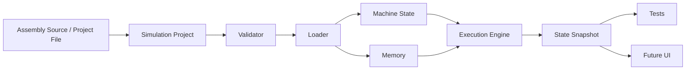
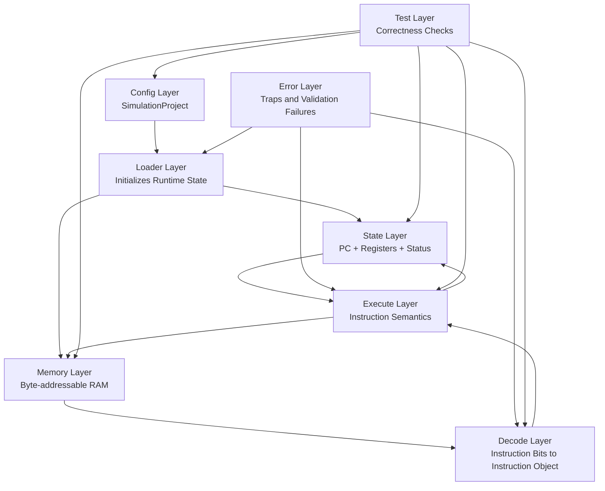
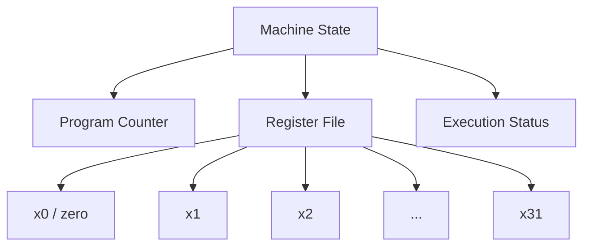
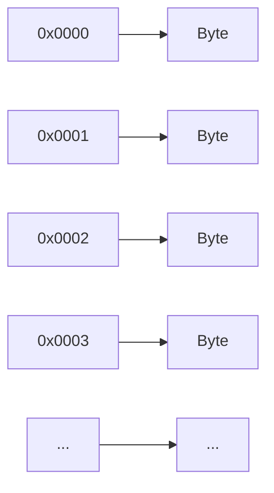
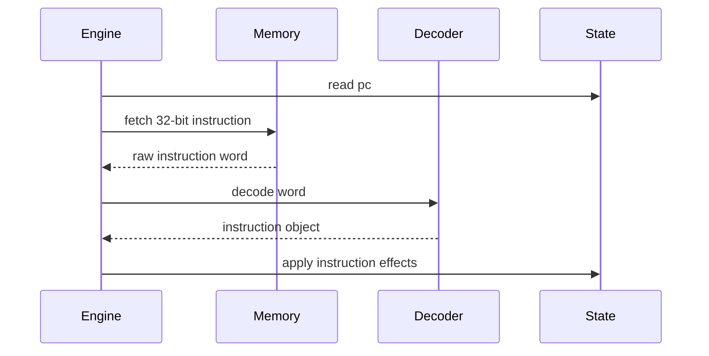
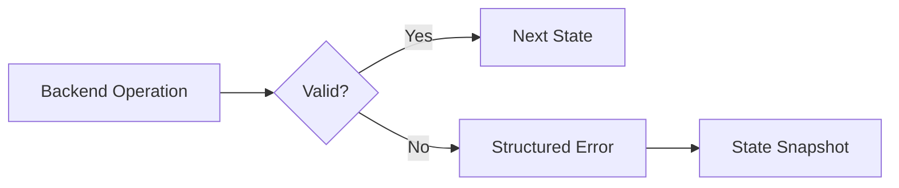
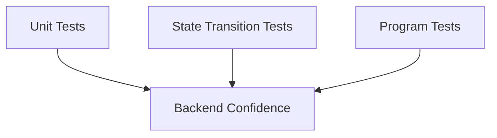

# Silicon Simulator

## A RISC-V CPU Simulator for Computer System Architecture

**Domain:** Computer System Architecture  
**Current Scope:** Phase 1 backend simulator  
**Target ISA:** RISC-V `RV64I`  
**Technology:** Dart backend, Flutter UI planned

---

# 1. Project Overview

Silicon Simulator is a modern CPU simulator designed to execute and visualize RISC-V assembly programs.

The project focuses on building a clear architectural model of a CPU rather than only displaying program output. The simulator is intended to show how instructions move through the system, how registers and memory change, and how the program counter controls execution.

## Phase 1 Focus

- `RV64I` base integer architecture
- single-cycle execution model
- byte-addressable memory
- register and program counter state
- assembly-driven program input
- backend-first implementation
- robust tests for simulator correctness

## Presenter Notes

This opening slide should establish the project in one sentence: this is not just a UI application, it is a CPU simulator built for Computer System Architecture learning and experimentation.

The main point to say here is that the project is centered on architectural visibility. A normal program only shows output, but a CPU simulator should show the internal machine state:

- what instruction is currently being executed
- how registers change
- how memory changes
- how the program counter moves

If a teacher asks why Phase 1 is backend-focused, the answer is:

- if the backend is incorrect, then the UI only visualizes incorrect behavior
- architecture projects should prioritize correctness of the execution model before visual polish

Good speaking line:

`The main objective of Phase 1 is to make the CPU behavior correct, deterministic, and inspectable before building a richer interface on top of it.`

Likely questions:

- Why did you start with backend first?
- Why not build the UI first and fill the backend later?
- What exactly is being simulated right now?

### Expanded Speaking Notes

When presenting this slide, make it clear that the project is not just a compiler demo, not just a UI, and not just a classroom toy. It is a simulator whose purpose is to expose processor behavior in a form that is understandable and testable.

The strongest way to speak about this slide is:

- first define the project in one sentence
- then define what Phase 1 means
- then define why backend-first matters

You can say:

`Silicon Simulator is a RISC-V CPU simulator built for CSA. The important idea is that it does not only run assembly, it exposes internal machine behavior like PC movement, register updates, memory writes, and instruction execution flow. In Phase 1, the goal is to make that backend correct and observable before making the UI more sophisticated.`

You should also mention that the current implemented work is already enough to demonstrate a full path:

- assembly input
- machine setup
- loading
- execution
- state inspection

### Model Answers

**Why did you start with backend first?**  
Because the backend defines the truth of the simulator. If register updates, memory behavior, or decoding are wrong, then the UI cannot fix that. For a CSA project, the architecture model must be correct before the presentation layer becomes important.

**Why not build the UI first and fill the backend later?**  
That would be risky because the UI would either depend on unfinished backend contracts or start owning CPU behavior itself. I wanted the UI to consume a stable simulator runtime, not invent execution logic in widgets.

**What exactly is being simulated right now?**  
Right now the simulator models a Phase 1 `RV64I` machine: program counter, 32 integer registers, byte-addressable memory, instruction fetch/decode/execute, structured errors, and a workbench UI that drives this backend.

---

# 2. Motivation

Many educational CPU simulators are useful for learning, but they often have limitations:

- outdated interface design
- limited state visualization
- weak separation between UI and simulator logic
- poor extensibility
- difficult testing of internal CPU behavior

Silicon Simulator aims to provide a cleaner architecture and a more modern simulation experience.

The first goal is not to implement every possible CPU feature. The first goal is to build a correct, inspectable, and testable CPU simulation core.

## Presenter Notes

This slide is where you justify the project.

Do not only say that existing tools are old. The stronger argument is that many educational simulators are weak in one or more of these areas:

- architecture separation
- observability of internal state
- testability of simulator logic
- modern usability

For CSA, the most important criticism is not visual age alone. It is that many tools do not make the machine model explicit in a clean software architecture.

You can say:

`The project is motivated by both educational and engineering reasons. Educationally, we want clearer CPU-state inspection. Engineering-wise, we want a simulator whose logic can be tested and extended cleanly.`

Likely questions:

- Which limitations of older simulators matter most for a CSA project?
- Is this project mainly educational or mainly practical?
- What makes your simulator “better” in a technical sense?

### Expanded Speaking Notes

The key thing on this slide is to avoid sounding like the project exists only because older tools look old. The stronger claim is that this project tries to improve the architectural clarity of the simulator itself.

You can explain that a simulator is most useful when:

- it makes machine state visible
- it separates CPU logic from presentation logic
- it is testable enough that the results can be trusted

That is especially important in CSA, because the project is supposed to model how a machine behaves internally, not only to produce the right final program answer.

You can say:

`The motivation is not only modern UI. The bigger motivation is to make the architecture of the simulator itself cleaner, so that registers, memory, decoding, execution, and errors are all modeled explicitly and can be tested independently.`

### Model Answers

**Which limitations of older simulators matter most for a CSA project?**  
The most important ones are weak observability of internal state, weak separation between UI and CPU logic, and difficulty testing the simulator itself. Those directly affect how well the project teaches architecture.

**Is this project mainly educational or mainly practical?**  
Its immediate purpose is educational and architectural, but it is implemented as a practical software system. So it is educational in goal, but engineered as a real application.

**What makes your simulator “better” in a technical sense?**  
The backend/UI separation, explicit machine-state modeling, dedicated memory subsystem, structured execution results, project persistence, and layered testing make it technically stronger than a UI-only or monolithic simulator design.

---

# 3. Architecture Goals

The simulator architecture is based on the following goals:

- separate CPU logic from UI logic
- represent machine state explicitly
- model memory as a real byte-addressable subsystem
- separate fetch, decode, and execute responsibilities
- keep execution deterministic
- expose read-only snapshots for debugging and UI display
- test each backend layer independently

This makes the project suitable for studying CPU architecture concepts such as registers, memory, instruction formats, control flow, and state transitions.

## Presenter Notes

This slide is important because it frames the rest of the deck. These are not random goals. Each one maps to a concrete architectural decision later.

You can explain the mapping like this:

- `separate CPU logic from UI logic` leads to backend/UI separation
- `represent machine state explicitly` leads to the `MachineState` model
- `model memory as a real byte-addressable subsystem` leads to the `Memory` class
- `separate fetch, decode, and execute` leads to the staged execution architecture
- `keep execution deterministic` supports reproducibility and testing
- `expose read-only snapshots` supports UI and debugging without corrupting state
- `test each backend layer independently` leads to layered tests

Good speaking line:

`This slide is the design contract of the whole project. Every later module exists because of one or more of these goals.`

Likely questions:

- Why are snapshots needed if the runtime already has state?
- Why is determinism so important here?
- Why not just keep all CPU logic directly inside the UI state?

### Expanded Speaking Notes

This slide should be presented as the architectural philosophy of the whole project. You can treat it almost like requirements for the software architecture.

Each bullet should be connected to a concrete implementation idea:

- explicit machine state became `MachineState`
- explicit memory became `Memory`
- stage separation became fetch/decode/execute logic
- deterministic behavior became repeatable step/run behavior
- read-only inspection became snapshots
- testing became multiple test layers

You can say:

`These are not just general software goals. Each one is directly tied to a CPU-simulation requirement. For example, explicit state is needed because architecture is really about state transitions; determinism is needed because simulators must be reproducible; and fetch/decode/execute separation is needed because those stages have different architectural meanings.`

### Model Answers

**Why are snapshots needed if the runtime already has state?**  
Because the runtime state needs controlled mutation, while the UI and tests need safe observation. Snapshots let the UI inspect state without directly mutating the machine internals.

**Why is determinism so important here?**  
Because if the same program and configuration can produce different results, then neither testing nor teaching is reliable. Deterministic behavior is essential for debugging and for architectural trust.

**Why not just keep all CPU logic directly inside the UI state?**  
Because that would tightly couple simulator behavior to one interface. It would be harder to test, harder to extend, and architecturally weaker. CPU logic should exist independently of any UI.

---

# 4. High-Level System Architecture



The backend receives a simulation project, validates it, loads it into memory, executes instructions, and produces state snapshots.

The UI is planned as a separate layer. It will display snapshots and send commands such as step, run, reset, and load.

## Presenter Notes

This is one of the most important architecture slides. Walk through the diagram left to right.

Suggested explanation order:

1. The user provides assembly or a saved project file.
2. That input becomes a structured `SimulationProject`.
3. Validation checks whether the setup is legal.
4. The loader converts the project into initialized machine state and memory.
5. The execution engine mutates that state instruction by instruction.
6. Snapshots expose the state safely to tests and UI.

You should stress that the UI does not directly own CPU execution. It only interacts through the backend contract.

Good speaking line:

`The central architecture decision is that the backend is the source of truth, and the UI is only a consumer of backend state.`

Likely questions:

- What exactly is inside the project model?
- Why is validation a separate stage?
- Why do tests consume snapshots instead of directly poking internal fields?

### Expanded Speaking Notes

This slide is the system-flow explanation. The best way to speak through it is sequentially:

1. input enters as assembly text or a project file  
2. the input becomes a structured project object  
3. validation checks legality  
4. loader creates initialized runtime state  
5. execution mutates state  
6. snapshots expose state safely

You should also say that this sequence reflects good architectural layering. Each stage exists so the next stage can make stronger assumptions.

You can say:

`The high-level architecture is intentionally staged. A raw text input is too weak to execute directly, so it first becomes a project model. The project model is validated. Then the loader constructs the actual runtime state. After that, execution can proceed. Finally, snapshots expose the result to tests and UI.`

### Model Answers

**What exactly is inside the project model?**  
The project model includes ISA target, memory size, load address, entry point, assembly source, optional register overrides, and optional memory initialization blocks.

**Why is validation a separate stage?**  
Because invalid setup should be detected before runtime execution begins. That keeps loader and execution code simpler and more reliable.

**Why do tests consume snapshots instead of directly poking internal fields?**  
Because snapshots represent the observable contract of the backend. They let tests verify behavior without depending too much on internal implementation details.

---

# 5. Why RISC-V `RV64I`

RISC-V is used because it is open, modular, and well documented.

`RV64I` is the 64-bit base integer instruction set. It provides a realistic architecture while keeping Phase 1 manageable.

## Phase 1 Includes

- 32 integer registers
- 64-bit register width
- program counter
- integer arithmetic and logical instructions
- branch and jump instructions
- load and store instructions

## Phase 1 Does Not Include

- pipelining
- privileged mode
- virtual memory
- compressed instructions
- floating-point instructions
- custom CPU creation

**References:**  
RISC-V Unprivileged ISA: https://docs.riscv.org/reference/isa/v20240411/unpriv/intro.html  
RV64I: https://docs.riscv.org/reference/isa/v20240411/unpriv/rv64.html

## Presenter Notes

This slide answers the ISA-selection question directly.

You should explain three points:

1. Why RISC-V:
   It is open, standard, and modular.
2. Why `RV64I`:
   It is realistic enough to be serious, but smaller than implementing many extensions immediately.
3. Why not full RISC-V in Phase 1:
   That would expand scope too fast and reduce confidence in correctness.

You can also mention that `RV64I` gives you:

- 32 general-purpose integer registers
- fixed programmer-visible state
- clean arithmetic, branch, and memory instruction classes

Good speaking line:

`RV64I gives this project a real ISA foundation without turning the first phase into an unbounded implementation problem.`

Likely questions:

- Why `RV64I` instead of `RV32I`?
- Why not include extensions like `M` or `C` now?
- Why choose a real ISA instead of inventing a simpler custom teaching ISA?

### Expanded Speaking Notes

This slide should make the ISA choice sound intentional and disciplined.

You should explain:

- RISC-V gives the project an open and standard architectural base
- `RV64I` is large enough to be serious
- the base integer set is still small enough for a first milestone

You should also point out that using a real ISA gives stronger documentation grounding and makes the simulator more useful beyond a classroom-only toy environment.

You can say:

`The project intentionally takes a real-ISA route rather than a toy-ISA route. `RV64I` gives enough realism to make the simulator meaningful, while still keeping Phase 1 bounded enough to verify carefully.`

### Model Answers

**Why `RV64I` instead of `RV32I`?**  
`RV64I` gives the project a more modern 64-bit architecture target and supports a stronger long-term direction, while still remaining manageable as a base ISA.

**Why not include extensions like `M` or `C` now?**  
Because the first milestone needed to stay bounded. It is better to implement and test the base ISA correctly first, then extend it in later phases.

**Why choose a real ISA instead of a custom teaching ISA?**  
Because a real ISA makes the project technically stronger, easier to ground in official references, and more useful for actual architecture experimentation later.

---

# 6. Backend Module Architecture



Each module has a specific responsibility. This prevents the simulator from becoming a monolithic program where decoding, execution, memory, and UI behavior are mixed together.

## Presenter Notes

This slide should be explained module by module.

Suggested order:

- `Config`: input contract
- `State`: programmer-visible CPU state
- `Memory`: RAM behavior and typed access
- `Loader`: turns config into initialized runtime
- `Decode`: interprets raw instruction bits
- `Execute`: applies instruction semantics
- `Errors`: structured failures instead of silent issues
- `Tests`: checks every layer

What to emphasize:

- decode is different from execute
- loader is different from project validation
- state is different from snapshot/export

Good speaking line:

`The backend is decomposed according to architectural responsibility, not according to UI screens or convenience methods.`

Likely questions:

- Why is loader separate from config?
- Why is memory not just part of machine state?
- Why is error handling treated as its own module concern?

### Expanded Speaking Notes

This slide is your software-architecture breakdown. It is one of the strongest answers to “where is the architecture in this project?”

The main point is that the project is decomposed by architectural responsibility, not by convenience:

- config defines the simulation
- loader initializes the simulation
- state stores the CPU-visible machine
- memory stores byte-addressable data
- decode interprets bits
- execute applies semantics
- errors explain faults
- tests verify each layer

You can say:

`This module structure mirrors CPU-simulator concerns directly. It avoids a monolithic program where one class tries to do parsing, state, memory, execution, UI, and error handling all at once.`

### Model Answers

**Why is loader separate from config?**  
Config describes the simulation declaratively. Loader turns that description into real runtime objects. Those are different responsibilities and should remain separate.

**Why is memory not just part of machine state?**  
Because memory has its own behaviors such as alignment checks, byte-width access, and little-endian helpers. Treating it as a subsystem makes those rules clearer.

**Why is error handling treated as its own module concern?**  
Because failures occur across validation, memory, decoding, and execution. A structured shared error model gives consistency across all those layers.

---

# 7. Simulation Project Model

The simulation project is the input contract for the backend.

It describes:

- target ISA: `rv64i`
- memory size
- program load address
- entry point
- assembly source
- initial register values
- initial memory contents

This model allows the simulator to support both an editor-based workflow and a file-based workflow.

```yaml
isa: rv64i
memory:
  size_bytes: 65536
program:
  load_address: 0x0000
  entry_point: 0x0000
registers:
  sp: 0x8000
assembly: |
  addi t0, zero, 5
  addi t1, zero, 7
  add  t2, t0, t1
```

## Presenter Notes

This slide explains the input boundary of the simulator.

You should say that the project model is important because a simulation is not defined only by assembly code. It is defined by:

- code
- memory size
- where the program is loaded
- where execution begins
- initial register values
- initial memory contents

That means the project model represents a full machine setup, not just a source file.

Also mention that this allows both:

- editor-driven use inside the UI
- saved file workflows for reproducibility

Good speaking line:

`The project model makes the simulator reproducible, because it captures both the program and the machine configuration in one object.`

Likely questions:

- Why is assembly text stored in the project instead of separately?
- Why does the simulator need load address and entry point both?
- Why is a file-based workflow useful for a CSA simulator?

### Expanded Speaking Notes

This slide is where you explain that a simulation session is more than just source code. To reproduce a CPU experiment, you need:

- the program
- machine size
- start address
- execution entry point
- optional initial state

That is why the project model exists and why the file-based workflow matters.

Now that project open/save is implemented, you can say that this is not just a design idea. The current workbench already uses the same project model to save and reopen simulations.

### Model Answers

**Why is assembly text stored in the project instead of separately?**  
Because the program text is part of the simulation definition. Keeping it in the project object allows one file to describe the whole experiment.

**Why does the simulator need load address and entry point both?**  
Because where a program is stored in memory and where execution begins are related but not identical concepts. Modeling both explicitly is architecturally cleaner.

**Why is a file-based workflow useful for a CSA simulator?**  
Because it supports reproducibility, sharing, and repeated demonstrations. A saved project preserves both code and machine setup.

---

# 8. CPU State Model

The CPU state represents the architectural state of the simulated processor.



## Important Rules

- `pc` stores the address of the current instruction.
- There are 32 integer registers.
- In `RV64I`, registers are 64 bits wide.
- `x0` is always zero.
- Writes to `x0` are ignored.

This state model follows the RISC-V programmer-visible architecture.

## Presenter Notes

This is the CPU-state definition slide. Explain that the simulator does not model a CPU vaguely; it models the explicit architectural state visible to a programmer.

Key explanation points:

- `pc` decides which instruction is fetched next
- the register file stores integer architectural values
- status tells whether the machine is ready, running, halted, or trapped
- `x0` is special because it is hard-wired to zero in RISC-V

If asked why `x0` matters, say:

- it is a real ISA rule
- the simulator enforces it centrally in the register file
- this avoids bugs in instruction handlers

Good speaking line:

`A simulator becomes trustworthy only when its architectural state is explicitly modeled and its invariants are enforced in one place.`

Likely questions:

- What is the difference between architectural state and internal runtime state?
- Why do writes to `x0` need explicit protection?
- Is memory part of CPU state or separate?

### Expanded Speaking Notes

This is the slide where you define the CPU model itself. Explain that the simulator tracks the state that matters from the instruction-set point of view:

- program counter
- general-purpose registers
- status

You should emphasize `x0` because it shows that the simulator is not only storing values; it is enforcing ISA rules.

You can say:

`The machine state is not an arbitrary software object. It is designed to match the programmer-visible architecture of RV64I. That is why the register file and program counter are central, and that is why invariants like the zero register are enforced directly in the state layer.`

### Model Answers

**What is the difference between architectural state and internal runtime state?**  
Architectural state is the machine state that defines program execution from the ISA point of view, like registers and `pc`. Internal runtime state is software structure used to manage execution. The project keeps those related but still distinguishes observation via snapshots from mutation during execution.

**Why do writes to `x0` need explicit protection?**  
Because `x0` must always remain zero in RISC-V. If the simulator lets it change, then instruction behavior becomes architecturally wrong.

**Is memory part of CPU state or separate?**  
Memory is part of the overall machine behavior, but in the implementation it is modeled as a separate subsystem because it has its own rules and helpers.

---

# 9. Memory Model

Phase 1 uses a simple flat memory model.

## Memory Properties

- byte-addressable
- default size: 65,536 bytes
- zero-initialized
- bounds-checked
- little-endian for multi-byte reads



Memory is required from the beginning because instruction fetch, load/store instructions, stack behavior, and data manipulation all depend on it.

## Presenter Notes

This slide explains that memory is not optional infrastructure. It is part of the architecture.

Important ideas:

- byte-addressable means each address points to one byte
- flat memory means there is no virtual memory or segmentation in Phase 1
- little-endian means lower-address bytes store lower-significance bits
- bounds checking is important to avoid invisible failures

You should also justify the simpler model:

- flat memory is enough for Phase 1 correctness
- more advanced models like virtual memory are future extensions

Good speaking line:

`The memory model is intentionally simple, but it is still a real architectural subsystem, not just an array hidden inside the program.`

Likely questions:

- Why little-endian?
- Why flat memory instead of segmented or virtual memory?
- Why is memory size configurable?

### Expanded Speaking Notes

This slide should make clear that memory is not a background implementation detail. It is one of the core architectural subsystems of the simulator.

The simple flat model is a deliberate Phase 1 choice. It lets the simulator correctly support:

- instruction fetch
- loads and stores
- stack-like usage
- explicit memory inspection

without yet taking on the complexity of virtual memory or privilege-based translation.

You can say:

`The memory model is intentionally minimal but still architecturally meaningful. It is byte-addressable, little-endian, bounds-checked, and visible through the simulator interface.`

### Model Answers

**Why little-endian?**  
Because that matches standard RISC-V system behavior and makes the simulator align with common real-world usage.

**Why flat memory instead of segmented or virtual memory?**  
Because flat memory is sufficient for the first correctness-focused milestone. More advanced memory models are future extensions after the base execution semantics are stable.

**Why is memory size configurable?**  
Because machine setup is part of the simulation definition. Different experiments may require different memory sizes, and the simulator supports that through the project model.

---

# 10. Execution Cycle

Phase 1 uses a single-cycle architectural execution model.


## Step Flow

1. Read instruction at the current `pc`.
2. Decode the instruction fields.
3. Execute the instruction semantics.
4. Update registers or memory.
5. Compute the next `pc`.
6. Return the next state or an error.

The single-cycle model acts as the reference implementation before adding pipeline behavior in later phases.

## Presenter Notes

This slide is your main execution-model justification.

You should explain that “single-cycle” here means a single architectural transition, not a physical timing simulation of real hardware clocks.

What to say:

- each instruction is treated as one full state transition
- fetch, decode, execute, and commit happen conceptually in one step
- this model is easier to validate than a pipelined model

Why this matters:

- it provides a correctness baseline
- later pipeline implementations can be checked against it

Good speaking line:

`The Phase 1 engine is a reference model. It is simpler than a pipeline, but it is the right place to establish correctness first.`

Likely questions:

- Why not implement pipelining directly?
- Does single-cycle mean unrealistic?
- What exactly is committed at the end of each step?

### Expanded Speaking Notes

The important point here is that “single-cycle” is being used as an architectural abstraction, not as a claim about the exact timing of real hardware.

Each step produces a complete before/after transition:

- instruction fetched
- instruction decoded
- semantics applied
- registers or memory updated
- next `pc` computed

That makes the model easier to validate and easier to use as a baseline when pipelining is added later.

You can say:

`In this project, single-cycle means one complete architectural transition per instruction. That is the right abstraction for establishing correctness first.`

### Model Answers

**Why not implement pipelining directly?**  
Because pipelining adds hazards, stalls, forwarding, and control-flow complexity. It is easier and safer to first validate the architectural behavior with a simpler reference model.

**Does single-cycle mean unrealistic?**  
It is simplified, but it is still architecturally meaningful. It models the correct state transition for each instruction even though it does not model overlapping microarchitectural stages yet.

**What exactly is committed at the end of each step?**  
The resulting register updates, memory updates, CPU status, and next program counter are all part of the committed next state.

---

# 11. Fetch, Decode, Execute Separation

The simulator separates instruction handling into three stages.



## Why This Separation Matters

- Fetch handles memory access.
- Decode handles bit fields and instruction formats.
- Execute handles architectural behavior.

This makes the simulator easier to test and makes future pipeline implementation cleaner.

## Presenter Notes

This slide is where you clearly define each stage:

- Fetch: read the instruction word from memory using `pc`
- Decode: determine what instruction it is
- Execute: apply the architectural effect

Explain that mixing these stages would create two problems:

- testing becomes harder because one function does too much
- future pipeline modeling becomes harder because the stage boundaries are unclear

You can also connect this to CSA concepts:

- fetch corresponds to instruction memory access
- decode corresponds to control interpretation
- execute corresponds to datapath effect and write-back decisions

Good speaking line:

`Separation of fetch, decode, and execute is both a software-engineering decision and an architecture-teaching decision.`

Likely questions:

- Why does decode produce an instruction object instead of executing directly?
- Where is sign extension handled?
- How would this structure help later if you add pipelines?

### Expanded Speaking Notes

This slide is where you should carefully distinguish stage responsibilities.

Fetch:
- uses `pc`
- reads the instruction word from memory

Decode:
- interprets opcode and fields
- constructs a structured instruction representation

Execute:
- reads source values
- applies instruction semantics
- computes next state

That separation is helpful both conceptually and in code. It is easier to reason about, easier to test, and closer to how CPU stages are taught in architecture.

### Model Answers

**Why does decode produce an instruction object instead of executing directly?**  
Because decode and execution answer different questions. Decode answers what the instruction is. Execute answers what the instruction does. Separating them improves clarity and testing.

**Where is sign extension handled?**  
It is handled where it logically belongs: immediate interpretation in decode, and width-aware value interpretation in execution and memory helpers.

**How would this structure help later if you add pipelines?**  
Because pipelines are defined around stage boundaries. If fetch, decode, and execute are already separated, then introducing pipeline stages becomes much cleaner.

---

# 12. Error and Trap Handling

The backend must fail clearly when invalid execution occurs.

## Examples

- unsupported instruction
- invalid instruction encoding
- out-of-bounds memory access
- invalid project configuration
- misaligned instruction access



Structured errors make the simulator easier to debug, easier to test, and easier to display in a UI.

## Presenter Notes

Do not treat this as a small detail. In a simulator, error behavior is part of correctness.

Explain that when something goes wrong, the simulator should not silently continue or fail in an unclear way. Instead, it should produce:

- an explicit error kind
- a message
- optionally an address or context
- a trapped machine status

This matters because the same backend errors are useful for:

- testing
- debugging
- UI display
- explaining failures during demos

Good speaking line:

`A simulator is only educational if it can explain why execution stopped, not just stop.`

Likely questions:

- What kinds of failures are currently modeled?
- What is the difference between halt and trap?
- Why is `ecall` treated differently from `ebreak`?

### Expanded Speaking Notes

This slide should be explained as part of simulator correctness, not as a minor software detail.

A simulator that silently ignores errors is hard to trust. That is why this project uses structured simulator errors and explicit trapped states. Those errors are useful in three places:

- automated tests
- runtime behavior
- UI display

This is also where you can explain the difference between a deliberate stop and an error stop.

### Model Answers

**What kinds of failures are currently modeled?**  
The current implementation models invalid project setup, assembly errors, invalid or unsupported instructions, memory access errors, misaligned accesses, and environment-call traps.

**What is the difference between halt and trap?**  
Halt means execution stopped intentionally, such as through `ebreak` in the current workbench flow. Trap means execution stopped because a fault or unsupported condition occurred.

**Why is `ecall` treated differently from `ebreak`?**  
Because `ecall` normally expects some surrounding execution environment, such as an operating system or runtime service layer, which Phase 1 does not provide. `ebreak` is currently used as the explicit controlled stop instruction.

---

# 13. Testing Strategy

Testing is part of the simulator architecture.

## Test Layers

- project validation tests
- register file tests
- memory tests
- instruction fetch tests
- decoder tests
- instruction execution tests
- state-transition tests
- whole-program tests



A CPU simulator is vulnerable to small bit-level mistakes. Testing each layer prevents errors from spreading into later architecture components.

## Presenter Notes

This slide is very important if your teacher asks about rigor.

Explain the layers:

- validation tests check configuration correctness
- register/memory tests check basic architectural components
- decoder tests check bit interpretation
- execution tests check instruction semantics
- state-transition tests check before/after machine behavior
- whole-program tests check integrated execution

The strongest point to make is:

`A simulator can look correct in the UI while still being architecturally wrong. Testing is what prevents that.`

You can mention that the project now has passing automated tests across backend and widget layers.

Likely questions:

- Why not only test full programs?
- What is a state-transition test?
- What kinds of bugs are easiest to catch with decoder tests?

### Expanded Speaking Notes

This is where you show that the project is not only architecturally designed but also rigorously validated.

Explain the logic of the test layers:

- project validation tests catch invalid setup early
- register and memory tests catch foundational state bugs
- decoder tests catch bit-interpretation bugs
- execution tests catch instruction-semantic bugs
- whole-program tests catch integration bugs
- widget tests check whether the UI reflects simulator behavior

You can mention that the implementation now has a multi-layer passing test suite, which is important because CPU-simulator bugs are often small and easy to miss visually.

### Model Answers

**Why not only test full programs?**  
Because full-program failures are harder to localize. Smaller tests tell you whether the problem is in configuration, memory, decode, execution, or integration.

**What is a state-transition test?**  
It checks that one known initial machine state and one instruction produce one exact expected next state. It is a direct way to verify CPU semantics.

**What kinds of bugs are easiest to catch with decoder tests?**  
Opcode extraction mistakes, immediate-construction bugs, field-position mistakes, and unsupported-instruction handling mistakes are especially suited to decoder tests.

---

# 14. Current Implementation Plan

## Phase 1 Backend

- simulation project model
- project validation
- register file
- machine state
- memory subsystem
- instruction fetch
- `RV64I` decoder
- single-step execution engine
- backend test suite

## Phase 1.5 UI

- assembly editor
- register view
- memory inspector
- program counter display
- run, step, pause, and reset controls
- error display
- project open/save support

## Presenter Notes

This slide should be presented as “what Phase 1 and 1.5 are supposed to deliver,” then you can connect it to what is already implemented.

For backend:

- the important units are project model, state, memory, fetch/decode/execute, and tests

For UI:

- the important units are editor, controls, state inspection, and file workflow

If asked what is already completed versus planned, answer clearly:

- the core backend path exists
- the workbench UI exists
- persistence and machine setup exist
- more instruction breadth and refinement are still future improvement areas

Good speaking line:

`This slide defines the first usable milestone: a backend-correct simulator plus a workbench UI that can drive and inspect it.`

Likely questions:

- Which parts are fully working now?
- Which parts are prototype-level?
- What remains before you would call Phase 1 completely mature?

### Expanded Speaking Notes

This slide can now be spoken partly as plan and partly as progress.

The key message is:

- the backend architecture exists
- the UI workbench exists
- the project persistence path exists
- the remaining work is mainly refinement and broader instruction coverage

That is a strong position for a project presentation because it shows both planning discipline and implementation progress.

### Model Answers

**Which parts are fully working now?**  
The current working path includes project modeling, JSON persistence, machine state, memory, loader, runtime facade, implemented RV64I instruction subset, structured execution results, and the Phase 1.5 workbench UI.

**Which parts are prototype-level?**  
The UI is still a workbench rather than a polished final simulator interface, and the assembler and instruction coverage are narrower than a full RV64I implementation.

**What remains before you would call Phase 1 completely mature?**  
More exhaustive instruction coverage, stronger diagnostics, more tests for corner cases, and further UI refinement around editing and state inspection.

---

# 15. Future Scope

After the Phase 1 backend is stable, the project can expand in stages.

## Planned Extensions

- Flutter-based visual interface
- pipelined execution model
- pipeline hazard visualization
- additional RISC-V extensions such as `M`, `C`, and `Zicsr`
- memory-mapped devices
- CPU scheduling algorithm visualization
- broader system simulation experiments

The single-cycle engine remains important even after pipelines are added because it provides a correctness reference.

## Presenter Notes

This slide shows that the project has a roadmap beyond the first milestone.

Explain the logic of the roadmap:

- first establish architectural correctness
- then improve visualization
- then expand the ISA
- then move into pipeline and more advanced system behavior

The most important future-work statement is:

- the single-cycle engine is not throwaway code
- it remains the correctness oracle for later engines

Good speaking line:

`Future phases build on the Phase 1 engine instead of replacing it. That is why the current architecture matters.`

Likely questions:

- What extension would you implement first after RV64I?
- How would you validate a pipelined model against the current engine?
- Would you ever support custom CPUs later?

### Expanded Speaking Notes

This slide should show that the project has a realistic growth path.

The most important idea is that future work is layered on top of the current architecture, not disconnected from it. The current single-cycle engine remains valuable even after more advanced models are added.

You can say:

`The current backend is not throwaway work. It becomes the reference model for future features such as additional RISC-V extensions and pipelined execution.`

### Model Answers

**What extension would you implement first after RV64I?**  
The most natural next step would be `M` for multiplication/division or `Zicsr` for control/status behavior, depending on whether the next focus is arithmetic completeness or system-level features.

**How would you validate a pipelined model against the current engine?**  
By running the same programs on both models and checking that the final architectural state matches. The timing can differ, but the register/memory results should agree.

**Would you ever support custom CPUs later?**  
Possibly, but it is not the main direction of Phase 1. The project is intentionally RISC-V-first, even though the architecture was kept modular enough to avoid blocking future experimentation entirely.

---

# 16. Conclusion

Silicon Simulator is an architecture-focused RISC-V CPU simulator.

The project emphasizes:

- clear CPU state representation
- modular backend architecture
- deterministic instruction execution
- memory and register visibility
- separation between backend and UI
- strong testing for correctness

Phase 1 focuses on building a correct `RV64I` backend. Later phases will add UI, pipeline simulation, and broader system-level features.

## Presenter Notes

This is where you restate the project in the cleanest possible way.

Suggested structure:

1. What it is:
   a RISC-V CPU simulator
2. What makes it strong:
   architecture-first design
3. What Phase 1 delivers:
   correct backend and inspectable state
4. What comes later:
   broader UI and advanced architecture features

You should end on the architecture point, not on visual polish.

Good closing line:

`The main contribution of this project is not only that it runs assembly, but that it models and exposes CPU architecture in a clean, testable, and extensible way.`

Likely questions:

- What is the main technical contribution of this project?
- What part was most challenging architecturally?
- If you had more time, what would be the next most important improvement?

### Expanded Speaking Notes

The conclusion should leave the audience with one strong message: this project is not only about running assembly code; it is about exposing CPU architecture through a clean and testable software design.

A good summary structure is:

- real ISA
- explicit state model
- modular backend
- backend/UI separation
- deterministic execution
- layered testing

That combination is what makes it a serious CSA project.

### Model Answers

**What is the main technical contribution of this project?**  
The main contribution is a modular architecture for a RISC-V CPU simulator that explicitly models project configuration, machine state, memory, decoding, execution, runtime control, and UI interaction.

**What part was most challenging architecturally?**  
Designing the boundary between backend correctness and UI interaction was one of the hardest parts, because the simulator had to stay testable while still supporting a usable workbench interface.

**If you had more time, what would be the next most important improvement?**  
The next most important improvement would be broader and deeper RV64I instruction support with even stronger state-transition tests, because that increases simulator correctness while preserving the current architecture.

---

# References

- RISC-V Unprivileged ISA Specification: https://docs.riscv.org/reference/isa/v20240411/unpriv/intro.html
- RV64I Base Integer Instruction Set: https://docs.riscv.org/reference/isa/v20240411/unpriv/rv64.html
- RISC-V ISA Manual Snapshot: https://riscv.github.io/riscv-isa-manual/snapshot/unprivileged/
- Flutter Architecture Guide: https://docs.flutter.dev/app-architecture/guide
- Flutter State Management: https://docs.flutter.dev/data-and-backend/state-mgmt

## Presenter Notes

If asked about technical grounding, point to these references.

The strongest references are the official RISC-V documents because the architectural state and instruction-set decisions come from them directly.

Flutter references matter for the UI/backend separation and app-architecture justification, but the most important project correctness source is still the RISC-V ISA documentation.

If someone asks whether the simulator behavior is based on a real standard, the answer is yes: the project is grounded in the official unprivileged RISC-V ISA documentation.

### Model Answers

**Are these official references or secondary sources?**  
The most important sources here are official references, especially the RISC-V ISA documentation and the Flutter documentation.

**Which reference is most important for correctness?**  
The official RISC-V unprivileged ISA documentation is the most important correctness reference because it defines the architectural state and instruction semantics the simulator is based on.
